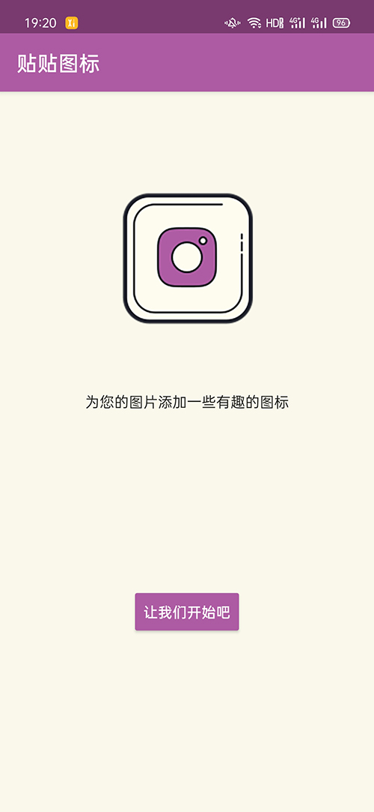

# 贴贴图标

## 简介

一个可以为自己的图片加上图标贴纸的app，主要是练习自定义view实现贴纸功能。

## 预览

预览图经过压缩，实际效果请使用app。

界面

生成的图片

## 实现原理

图片按层分为：毛玻璃背景层——>选择的图片——>若干贴纸，最终导出合成的图片。

### 1. 选择图片

图片选择不是本应用的重点，因此直接使用系统自带的SAF存储框架完成，不需要读存储权限，返回图片的Uri对象。

得到图片的Uri对象后，利用fileDescriptor可以解析为Bitmap对象，注意这里是耗时操作，需要放到IO线程处理

### 2.毛玻璃效果

得到图片的Bitmap后，利用RenderScript和ScriptIntrinsicBlur对象得到图片的blur模糊对象，之后写到bgBitmap里即可

需要View的注意绘制的顺序，让bgBitmap在最底层之后再绘制图片的Bitmap。

### 3. 图片的移动缩放旋转效果

这是写的最多的地方了，需要重写View的onTouchEvent方法处理多点触摸事件。

单点的情况比较好处理，就是移动图片，记录好坐标求差值即可。

多点的情况需要同时计算缩放和旋转，缩放记录好第一次双指的距离，之后每次双指移动做比值就求缩放率。

旋转需要记录好第一次两指相对于水平的角度，这里采用的是极坐标求弧度转化为角度，这样应该是最简单的了。

最后移动、旋转、触摸的相关值记录好，利用martix的改变坐标，然后绘制即可。

### 4. 自定义的View

这里定义了2个View，BgView和StickerView，实现上面的移动缩放旋转。

BgView存放了毛玻璃背景图bgBitmap和选择图片的imageBitmap。

StickerView负责处理贴纸的Bitmap，两个View的逻辑很相似，以后有时间可以抽取一个基类。

StickerView多了一个边框，上边有清除贴图的图标，这里暴露了一个接口setCloseView来让fragment去销毁用户关闭的贴纸StickerView。

### 5. 保存图片

按照背景Bitmap——图片Bitmap——各个贴纸Bitmap的顺序生成一个新的Bitmap，然后写到相册即可。

这里使用了分区存储，所以API28以上不需要写存储权限。API28以下还需要运行时写存储权限，用PermissionX申请的。
